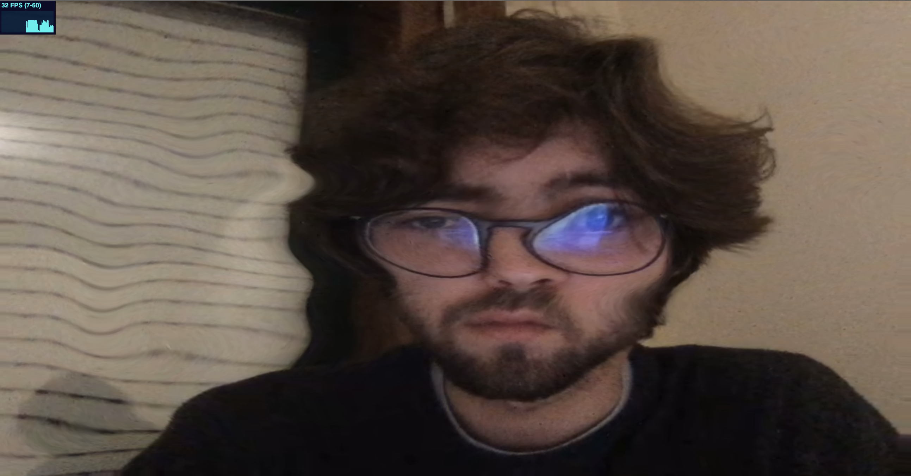
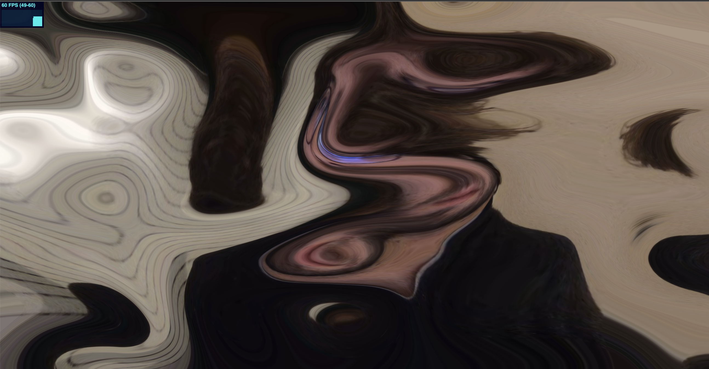

# Webcam Displacement Filter

Webcam Displacement Filter is a very simple and highly commented example of how to use React, Threejs and GLSL to create a displacement filter and apply it to a realtime webcam stream.

## Installation

Clone Repo.

```bash
https://github.com/bernabranco/react-threejs-webcam-displacement.git
```

Install dependencies.

```bash
npm install
```

## Usage

Start application.

```bash
npm start
```

Open browser on 'localhost:3000'

## Features

- Realtime Webcam Stream
- GLSL displacent filter
- Responsive Resizing
- FPS monotoring with 'Stats' component

## Images




## License

[MIT](https://choosealicense.com/licenses/mit/)

